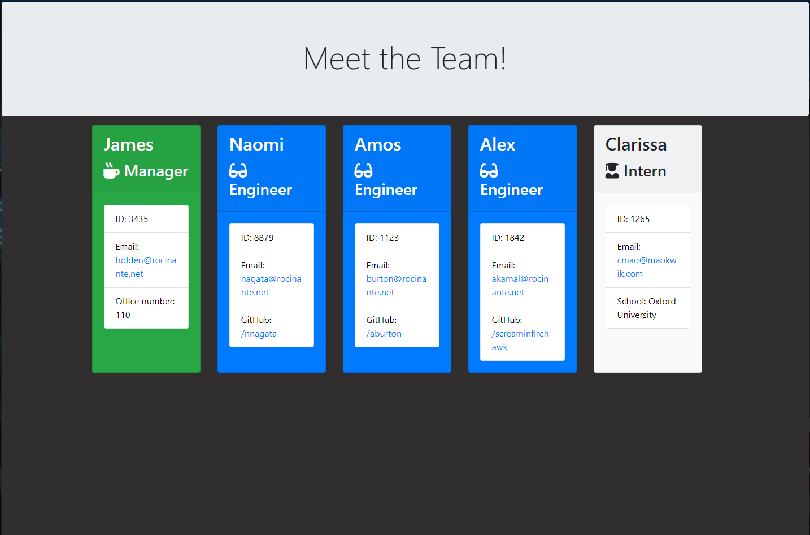

# TCell 
  
## Description 
      
  Powered by Node.js and Inquirer, TCELL is a Command Line Interface that allows teams to make a clean, professional organizational chart in minutes.

  
      
## Table of Contents
      
  * [Installation](#installation)
  * [Usage](#usage)
  * [Credits](#credits)
  * [Contributing](#contributing)
  * [Questions](#questions)
  * [Tests](#tests)
  * [License](#license)
      
      
## Installation
      
  TCell is available to download or clone onto your machine or intranet. Please note that you will also need Node.js installed for this program to run.
      
## Usage 
      
  Once installed, enter ```npm -i``` into your command line console to install Inquirer, which this application requires to work. Once this is done, run the  logic file, answer the prompts, and then copy the html file from the output folder into your project directory. 

  
      
  [Walkthrough Video](https://drive.google.com/file/d/1QqLvRhAWo2A6tQVcAiTBpV7cEJaXLM4B/view)

## Credits
      
  I'd like to thank my study group, whose advice, support, and peer review were crucial in getting this project to work. As always, my TAs and Instructor in the Columbia Engineering coding bootcamp were critical to the existence of this project.
      
## Contributing

  If you'd like to contribute to TCell, feel free to fork this repository and create a pull request. Contributions are governed by the Contributor Covenant, [which can be read here](https://www.contributor-covenant.org/).

## Questions?
  
  Questions about this project can be directed to: 
  - Github: /puentebravo
  - Email: puentematos@gmail.com

## Tests

  Tests are located in the /test folder. To run them, enter 'npm run test' into your console after you've installed all dependencies. 

## License
      
  Content in this project is governed under the MIT License. 

  To read the license in its entirety, click here: [MIT](./LICENSE)

  -----------
  
  Copyright [2021] [Charlie Puente]